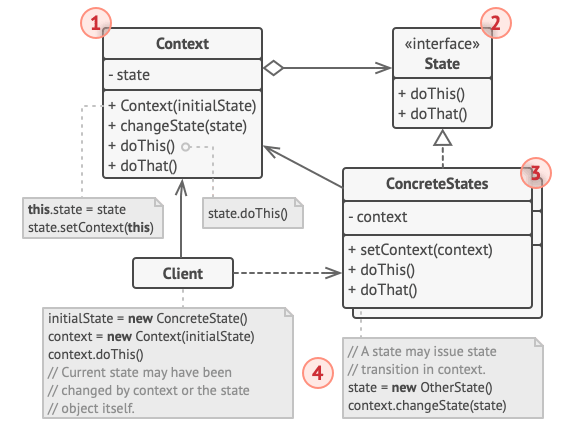

## Chain of responsibility - Chef lab10.ex2

Serve para atribuir uma certa resposibilidade específica a cada classe.

**Request** -> Handler -> Handler -> Handler -> **Ordering System**

Interface/abstract class -> concrete Handlers (extends abstract class) <- Client/Main faz o pedido para o primeiro concrete Handler da chain.

## Command - Command lab10.ex3

Comando específico para uma TV o Invoker pode chamar vários botões do comando e o Comando executa os comandos de cada botão.

Invoker (class que envia os comandos)-> Interface Command (execute()) -> Clase Concrete Commands (implementam a interface e definem a lógica para o certo comando) -> Class Receiver (recebe as operações) 

## Iterator - Iterator lab10.ex1

O Iterator serve para iterar pela estrutura de dados sem expor qual estrutura está a ser utilizada (basicamente um Facade para estrutura de dados).

Concrete Iterator <- Interface Iterator <-> Interface Collection -> Concrete Collection

## Mediator - Insurance lab11.ex3

O mediator serve para as classes comunicarem indiretamente (através de um mediator). O Mediator faz o reecaminhamento da mensagem.

Concrete Mediator (implements Mediator)-> Interface Mediator (notify(sender))-> Components (operation() e notify(this) ao Mediator)

## Memento

3 Classes

## Observer - Observer lab11.ex1

Server para notificar a todos os subscritos/oberservers quando o estado alterar.

Client (new ConcreteSubscriber) -> Publisher (notify Subscribers) -> Iterface Subscriber (update(context)) -> Concrete Subscribers (implements Subscriber)

## State - lab12.ex3

Como se fosse uma máquina de estados. Dependendo da ação toma um certo estado.

Context Class -> Interface State (doThis(), doThat()) -> Concrete States (implements State)

## Strategy - lab12.ex1 ou Calculator da aula TP

Permite selecionar o comportamento do algoritmo enquanto está a correr

NumberProcessor Context Class ->Interface Strategy (ex. Operation execute())-> Concrete Strategies (implements Strategy ex. Add/Divide/Multiply)

## Template

Define uma estruta específica na super Classe para depois serem override nas subclasses. Serve de Template.

Abstract Class -> Concrete Class (extends abstract Class)

## Visitor

Permite separar algoritmos dos objetos onde estes operam

Client -> Concrete Visitors -> Iterface Visitor -> Iterface Elemento -> Concrete Elemento

